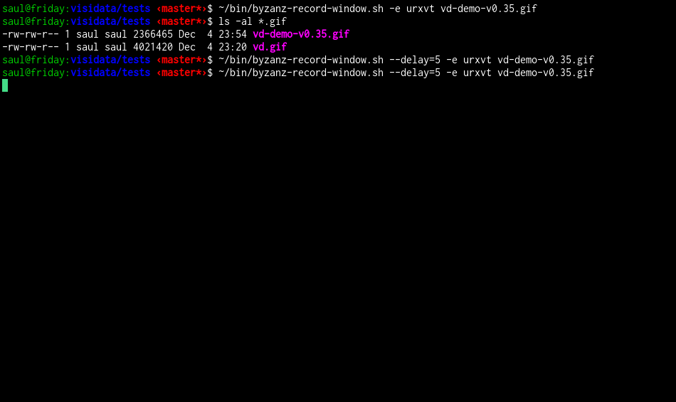

# VisiData v0.44

A curses interface for exploring and arranging tabular data

Usable via any remote shell which has Python3 installed.




# Getting Started

## Install VisiData

## from pypi (stable version)

```
$ pip3 install visidata
```

### from pypi (test server for develop version)

```
pip3 install -i https://testpypi.python.org/pypi visidata
```

### or clone from git

```
git clone http://github.com/saulpw/visidata.git
git checkout develop
```
### Dependencies

- Python 3.3
- python3-dateutil (if converting string column to datetime)
- openpyxl (if opening .xlsx files)
- h5py and numpy (if opening .hdf5 files)
- google-api-python-client (if opening Google Sheets; must [also set up OAuth credentials](https://developers.google.com/sheets/quickstart/python )

**Remember to install the Python3 versions of these packages with e.g. `pip3`**

## Run VisiData

If installed via pip3, `vd` should launch without issue, and open a listing of the current directory.

If installed via git clone, first set up some environment variables (per terminal):

```
export PYTHONPATH=<visidata_dir>
export PATH=<visidata_dir>/bin
```

## Usage

        $ vd [-r/--readonly] [<input> ...]

Inputs may be paths or URLs.  If no inputs are given, starts exploring the
current directory.  Unknown filetypes are by default viewed with a text
browser. Further documentation is available at [readthedocs](https://visidata.readthedocs.io/en/develop/).

## Contributing

VisiData was created by Saul Pwanson `<vd@saul.pw>`.

VisiData is currently under active development (as of May 2017).

VisiData needs lots of usage and testing to help it become useful and dependable.  If you are actively using VisiData, please let me know!  Maybe there is an easy way to improve the tool for both of us.

Also please create a GitHub issue if anything doesn't appear to be working right.
If you get an unexpected error (on the status line), please include the full stack trace that you get with `^E`.

### Branch structure

Visidata has two main branches:
* [stable](https://github.com/saulpw/visidata/tree/stable) has the most reliable and robust version of visidata.
* [develop](https://github.com/saulpw/visidata/tree/develop) has the most up-to-date version of visidata (which will eventually be pushed to stable).

If you wish to contribute, please fork from [develop](https://github.com/saulpw/visidata/tree/develop) and submit a [pull request](https://github.com/saulpw/visidata/pulls) against it. A developer's guide can be found [here](https://github.com/saulpw/visidata/blob/develop/docs/dev-guide.md

## License

VisiData is licensed under GPLv3.
