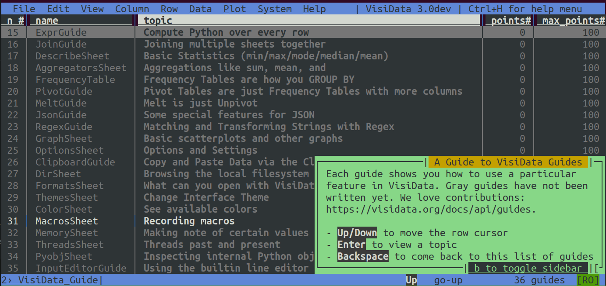

Guides
=======

A Guide is an in-app writeup of a particular feature that gives a basic synopsis of how to use it and explains how it works together with other features.

Open the Guide Index with ``Space open-guide-index`` within VisiData or ``vd -P open-guide-index`` from the CLI.

.. note::

    Guides that have not been written yet are grayed out.
    We love to get help with documentation, please get in touch if you want to write one or have other suggestions!

Here's an outline for adding a guide, with our writing style preferences:

1. Launch **GuideIndex** and find the ``name`` of the guide.
2. Create a markdown file ``visidata/guides/{name}.md``.
3. Write the guide.

Hello Guide
------------

This same general structure and process should work for most guides.

Step 1. Launch **GuideIndex** and find the ``name`` of the guide
~~~~~~~~~~~~~~~~~~~~~~~~~~~~~~~~~~~~~~~~~~~~~~~~~~~~~~~~~~~~~~~~

Within VisiData, ``Space open-guide-index`` to see the Table of Contents.

``gv`` to show the **name** column. Choose a guide to work on, and note down its **name**.
For example: **MacrosSheet**.

::

Step 2. Create a markdown file ``visidata/guides/{name}.md``
~~~~~~~~~~~~~~~~~~~~~~~~~~~~~~~~~~~~~~~~~~~~~~~~~~~~~~~~~~~~~

In this example, we would create a ``visidata/guides/MacrosSheet.md``.

At the top of the file, optionally place template front matter, using YAML syntax:

::

    ---
    sheettype: Sheet
    ---

This front matter will override the default configuration for guides.

At the moment, the main configurable option is ``sheettype``. ``sheettype`` is a string for the type of sheet that the guide involves. VisiData uses this to auto-complete command + options patterns (see "stylings of note").

Its default value is ``Sheet`` (aka TableSheet), the base class for every table sheet.

.. note::

    The vast majority of guides will not need to set the front matter or change the default sheet type. Only set it if command + option patterns are failing to auto-complete.

    Feel free to ask us if unsure which sheet type to use.

Step 3. Write the guide
~~~~~~~~~~~~~~~~~~~~~~~

Next, fill out the text for the guide:

::

    ---
    sheettype: Sheet
    ---
    # Macros
    Macros allow you to bind a command sequence to a keystroke or longname, to replay when that
    keystroke is pressed or the command is executed by longname.

    The basic usage is:
        1. {help.commands.macro-record}
        2. Execute a series of commands.
        3. `m` again to complete the recording, and prompt for the keystroke or longname to bind it to.

    # The Macros Sheet

    - {help.commands.macro-sheet}

    - `d` (`delete-row`) to mark macros for deletion.
    - {help.commands.commit_sheet}
    - `Enter` (`open-row`) to open the macro in the current row, and view the series of commands composing it.
    '''

Read the `style guide </docs/api/style>`_ for an overview of the stylings and markup.
