# Using Gmail with OAuth 2.0

## Why

As of May 30 2022, Google [doesn't allow](https://support.google.com/accounts/answer/6010255?hl=en) you to log into your IMAP gmail account using only a username/password combination.
So to open your Gmail in Visidata you need to create a Google API App, attach some scopes to it, generate a client ID and secret, then let Visidata use that client ID and secret (in a json file).

## How

First, go to the [Google Console](https://console.cloud.google.com/apis/dashboard)

 

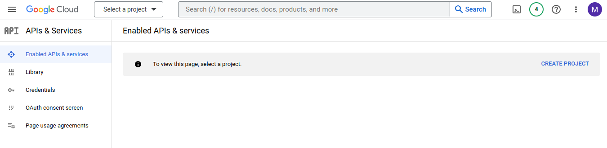

 

And click `CREATE PROJECT`

---

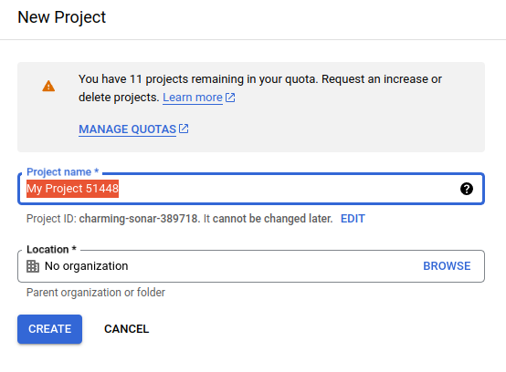

Give the project a name then click `CREATE`

---

Open a new tab and go to the [API Library](https://console.cloud.google.com/apis/library)

 

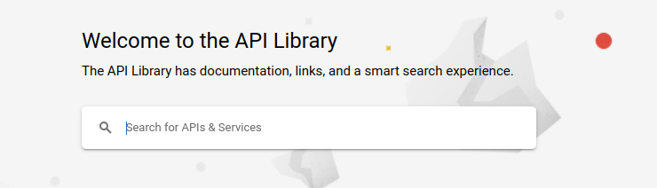

Search for `gmail`

---

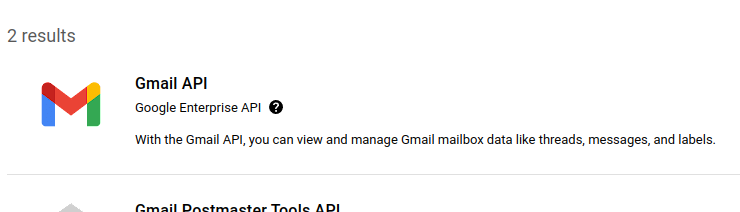

Click the search result `Gmail API`

---

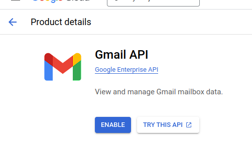

Click `ENABLE`

---

Go back to your first tab

On the left, select `OAuth consent screen` 

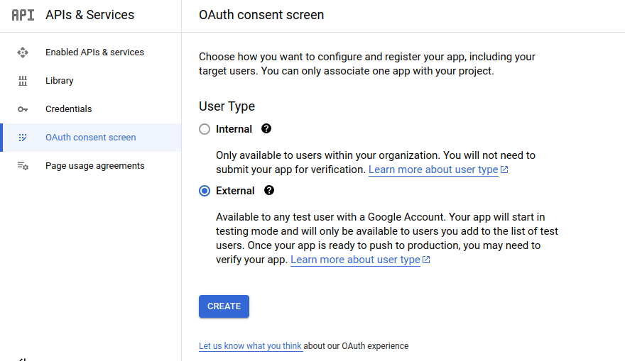

Then select `External` and click `CREATE` to create an App 

---

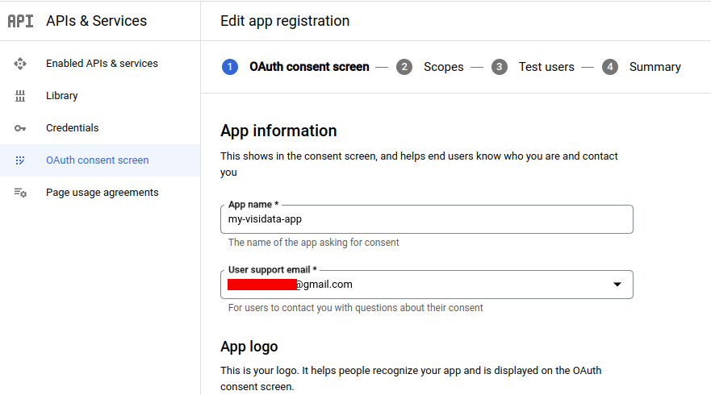

Give the App a name and input your gmail address.

---

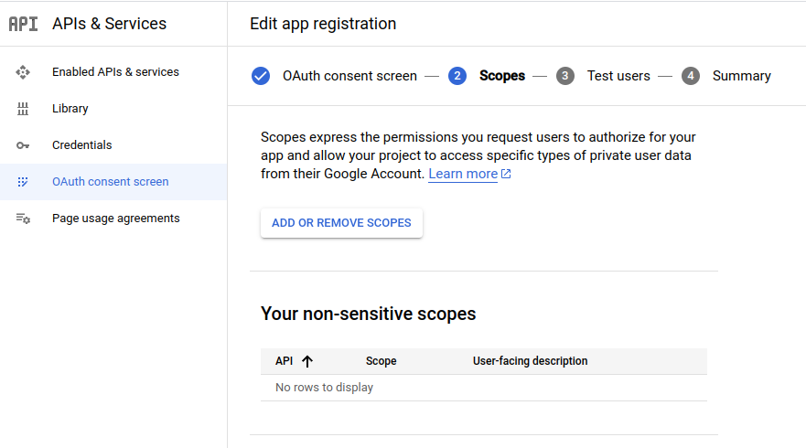

Click `ADD OR REMOVE SCOPES`

---

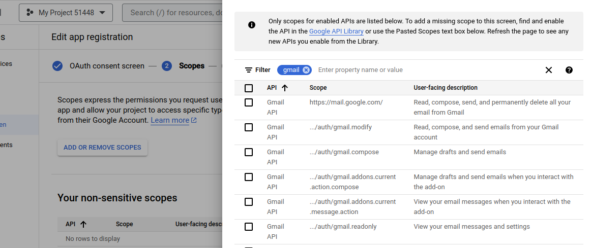

Search for `gmail`

---

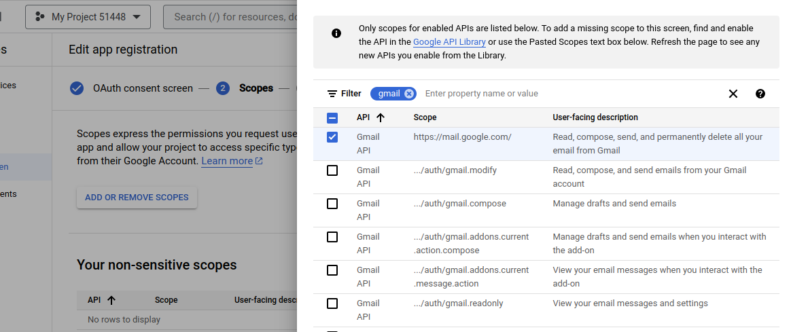

Click the checkbox by the row with the scope value `https://mail.google.com/`

Then scroll to the bottom

---

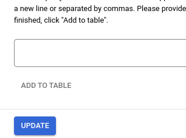

And click `UPDATE`

---

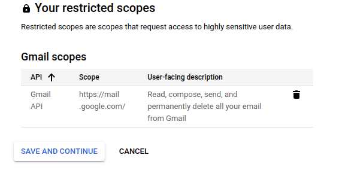

You should see your selected scopes.

Click `SAVE AND CONTINUE`

---

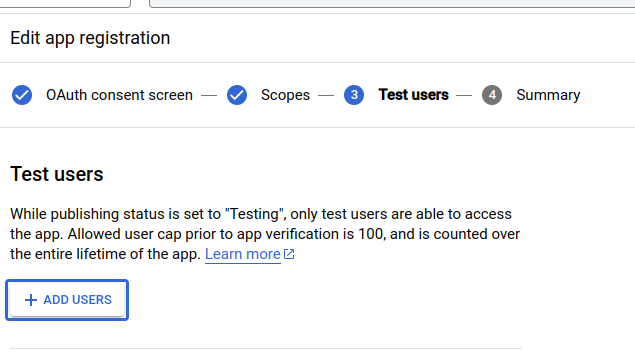

Click `ADD USERS`

---

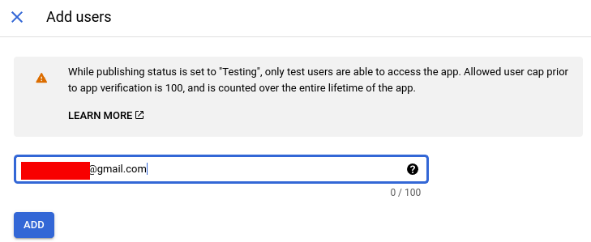

Type in your gmail email address then click `ADD`

---

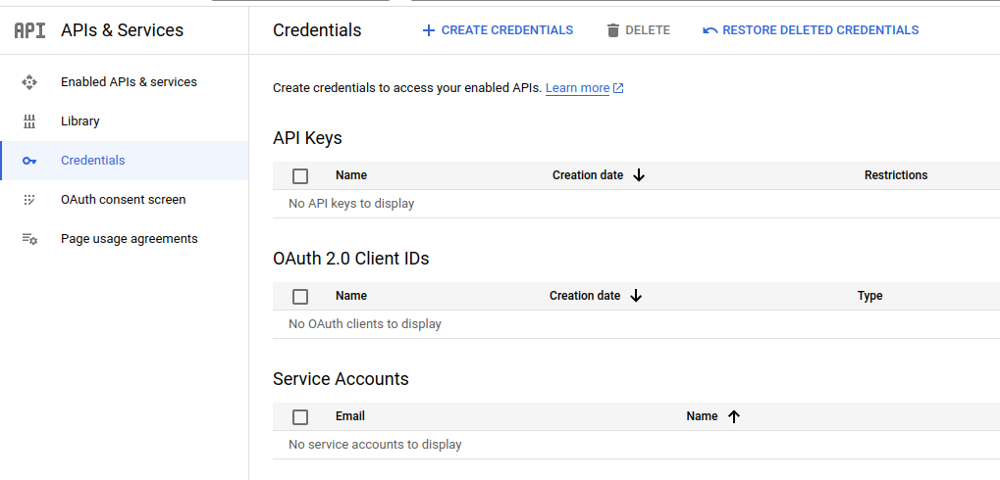

On the left, click `Credentials`

---

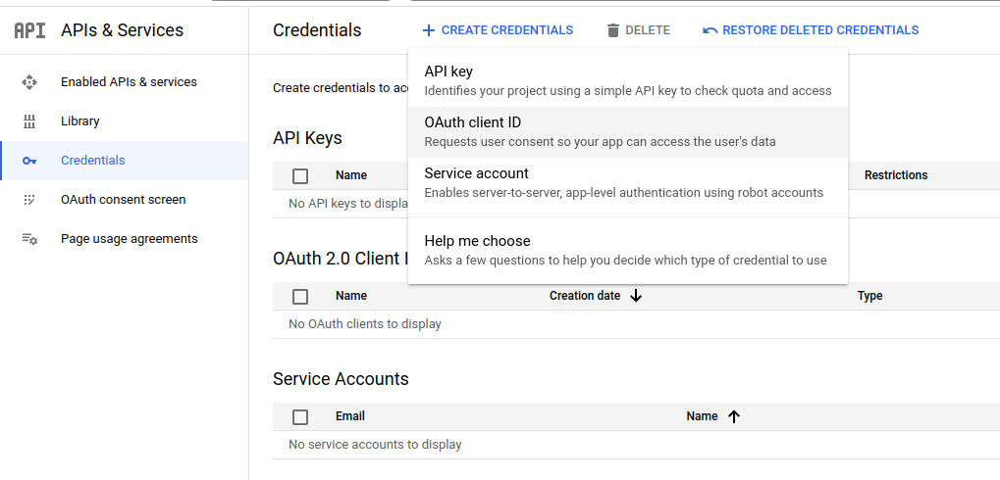

Near the top click `CREATE CREDENTIALS`

Then click `OAuth client ID`

---

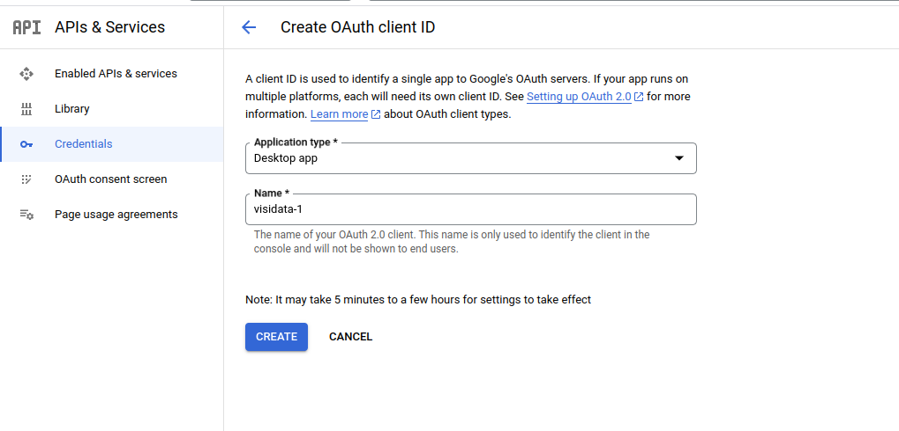

Select the application type `Desktop App` and give your OAuth 2.0 client a name then click `CREATE`

---

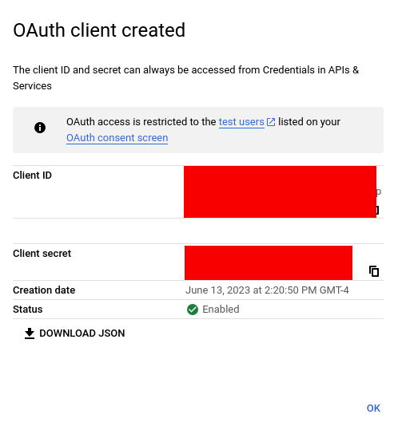

Click `DOWNLOAD JSON` and move the downloaded file into the visidata project directory at the path `vdplus/api/google/` and call the file `google-creds.json`

---

Now, on the command line run the equivalent for you:

`vd "imap://me@gmail.com@imap.gmail.com"`

Then you should get a web browser popup:

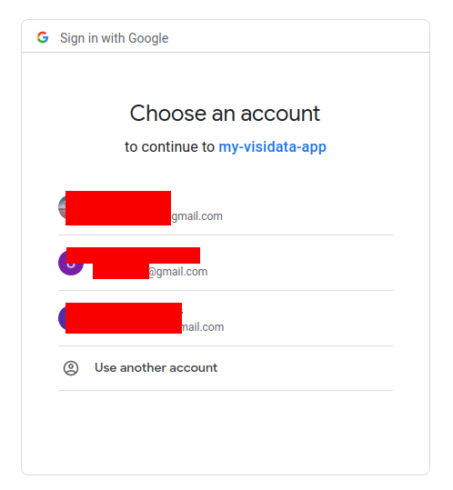

Select the account whose email address you have been using in these instructions.

---

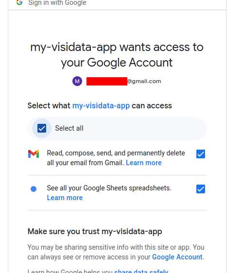

Click `Select all`

---

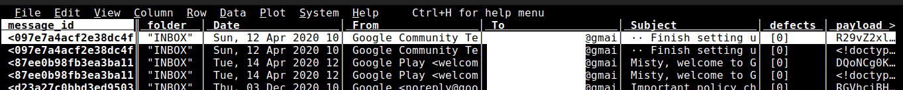

See your gmail in Visidata.

<Chef's Kiss>

---

