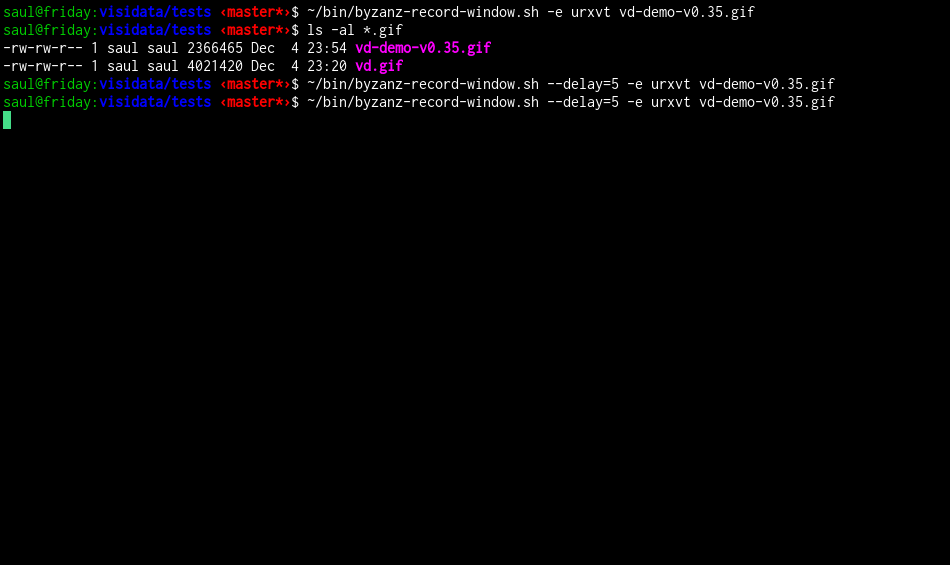

# VisiData v0.44

A curses interface for exploring and arranging tabular data

Usable via any remote shell which has Python3 installed.

## Installation

        $ pip3 install visidata

### Dependencies

- Python 3.3
- python3-dateutil (if converting string column to datetime)
- openpyxl (if opening .xlsx files)
- h5py and numpy (if opening .hdf5 files)
- google-api-python-client (if opening Google Sheets; must [also set up OAuth credentials](https://developers.google.com/sheets/quickstart/python )

**Remember to install the Python3 versions of these packages with e.g. `pip3`**

## Usage

        $ vd [-r/--readonly] [<input> ...]

Inputs may be paths or URLs.  If no inputs are given, starts exploring the
current directory.  Unknown filetypes are by default viewed with a text
browser.

## License

VisiData is licensed under GPLv3.
